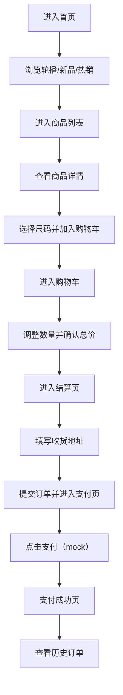

## 1. 产品概述
面向中国消费者的女装电商网站，整体风格参考 Zara / H&M，强调简洁现代的大图陈列与顺滑交互。
- 目标用户：偏好快时尚/通勤/基础款的女性消费者，主要使用手机端浏览与下单
- 价值：更快发现新品与热销款、清晰尺码与评价信息、顺畅完成下单与查看订单

## 2. 核心功能

### 2.1 用户角色
| 角色 | 注册方式 | 核心权限 |
|------|----------|----------|
| 访客 | 无 | 浏览商品、查看详情、加入购物车（本地保存） |
| 登录用户 | 邮箱注册/登录（mock） | 下单结算、查看历史订单、保存地址（本地保存） |

### 2.2 功能模块
1. **首页**：顶部导航、轮播图、新品推荐、热销商品、新用户弹窗
2. **注册/登录**：邮箱注册、邮箱登录、基础校验与错误提示
3. **商品列表**：筛选/排序（可选）、商品卡片、快速加入购物车
4. **商品详情**：大图画廊、价格与库存提示（mock）、尺码信息、用户评价
5. **购物车**：商品项编辑、数量调整、移除、总价即时更新
6. **结算**：收货地址表单、订单摘要、提交订单
7. **支付（mock）**：点击即支付成功、生成订单记录
8. **订单**：历史订单列表、订单详情（商品明细/地址/金额/状态）
9. **联系官方**：邮件联系入口（mailto）
10. **空状态**：未上线页面展示“敬请期待”

### 2.3 页面详情
| 页面名称 | 模块名称 | 功能描述 |
|----------|----------|----------|
| 首页 | 轮播图 | 自动轮播、可手动切换、支持跳转到活动/商品列表 |
| 首页 | 新品推荐 | 展示最新上架商品（mock 数据），支持进入详情/加入购物车 |
| 首页 | 热销商品 | 展示销量靠前商品（mock 数据），支持进入详情/加入购物车 |
| 首页 | 新用户弹窗 | 用户首次进入首页弹出一次，支持关闭并在本地记忆 |
| 注册/登录 | 邮箱注册 | 输入邮箱+密码创建账号（mock），表单校验与错误反馈 |
| 注册/登录 | 邮箱登录 | 输入邮箱+密码登录（mock），登录态本地保存 |
| 商品列表 | 商品网格 | 大图+名称+价格，支持进入详情、加入购物车 |
| 商品详情 | 图片画廊 | 1:1 或 4:5 大图优先，支持左右切换与缩略图 |
| 商品详情 | 尺码信息 | 尺码表/建议（mock），支持选择尺码并加入购物车 |
| 商品详情 | 用户评价 | 列表展示评分/文案/日期（mock），支持展开查看更多 |
| 购物车 | 数量调整 | + / - 与输入框，实时更新小计与总价 |
| 结算 | 收货地址 | 姓名/手机号/省市区/详细地址/邮编（可选），校验与提示 |
| 结算 | 订单摘要 | 按“单价×数量”计算，总价即时展示并随数量变动更新 |
| 支付 | 支付确认 | mock 支付按钮，点击直接显示支付成功并生成订单 |
| 订单 | 历史订单 | 列表展示订单号/时间/金额/状态（已支付），可查看详情 |
| 联系官方 | 邮件联系 | 打开默认邮箱客户端，新建邮件到官方地址并带主题（可选） |
| 未上线 | 空状态 | 统一风格“敬请期待”，提供返回/继续浏览入口 |

## 3. 核心流程
主要流程包含：浏览首页与商品列表 → 查看商品详情 → 加入购物车 → 结算填写地址 → mock 支付成功 → 订单生成与查看。

## 4. 用户界面设计

### 4.1 设计风格
- 主色：黑/白/灰（高对比、留白充分）
- 点缀色：柔和米色（暖感）或深蓝色（克制强调，用于 CTA/选中态/链接）
- 字体：偏编辑感的展示字体 + 易读正文无衬线（强调质感与清晰层级）
- 版式：大图为主、网格清爽、信息密度中等、轻量边界线与细分隔
- 动效：加载与切换使用细腻过渡，按钮/卡片 hover 与按压反馈自然
- 图标：全站使用统一风格 icon（不使用 emoji）

### 4.2 页面设计概览
| 页面名称 | 模块名称 | UI 要素 |
|----------|----------|---------|
| 首页 | 轮播图 | 大图、渐隐切换、底部指示点与左右切换按钮 |
| 首页 | 新品/热销 | 4:5 商品图、价格与简短标题、轻量卡片阴影/边框 |
| 注册/登录 | 表单 | 清晰输入框、错误提示、主 CTA 使用深蓝或米色强调 |
| 商品列表 | 网格 | 手机端 2 列网格（可根据屏幕自适应），避免横向滚动 |
| 商品详情 | 画廊/尺码/评价 | 顶部大图沉浸、尺码选择 chip、评价卡片可展开 |
| 购物车 | 列表/价格 | 左图右信息、数量步进器、总价吸底栏（移动端） |
| 结算 | 地址/摘要 | 分区表单、订单摘要固定在下方或侧栏（桌面端） |
| 支付 | 成功状态 | 成功提示、订单入口、继续逛逛 CTA |
| 订单 | 列表/详情 | 简洁列表、可点击卡片、金额与状态标识清晰 |
| 未上线 | 空状态 | “敬请期待”文案、返回按钮、推荐继续浏览入口 |

### 4.3 响应式
- 手机端优先：无横向滚动、文字不溢出、按钮可点（>=44px 可触）
- 断点策略：手机（1 列详情/2 列列表）→ 平板（2~3 列）→ 桌面（3~4 列）
- 图片策略：商品图优先，使用裁切与占位骨架，避免布局抖动

## 5. 验收标准（对应用例）
### P1
1. 支持邮箱注册并登录（mock）
2. 首页包含轮播图、新品推荐、热销商品
3. 首次进入首页弹出“新用户弹窗”
4. 商品列表可浏览商品
5. 商品详情展示大图、尺码信息、用户评价
6. 可加入购物车并进入结算填写收货地址
7. 总价按“单价×数量”计算且即时更新展示
8. 点击支付直接显示支付成功（mock）
9. 可查看历史订单

### P2
1. 手机端可正常浏览（无横向滚动，文字不溢出，按钮可点）
2. 支持邮件方式联系官方
3. 未上线页面显示“敬请期待”空状态
4. 全站黑白灰主色调，辅以米色或深蓝色点缀
5. 全站 icon 风格统一且不出现 emoji
