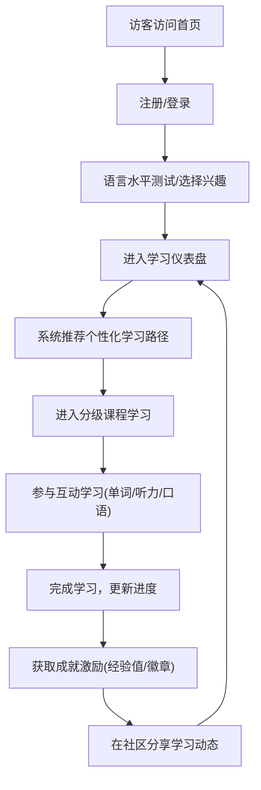

# 多语种在线教育平台产品需求文档 (PRD)

## 1. 产品概述
打造一款支持英语、日语、韩语等多语种学习的沉浸式在线教育平台。
致力于为语言学习者提供分级课程、互动练习、进度追踪及社区互动的全方位学习体验，通过个性化推荐和成就激励系统提升用户的学习动力与效果。

## 2. 核心功能

### 2.1 用户角色
| 角色 | 注册方式 | 核心权限 |
|------|---------------------|------------------|
| 访客 | 无 | 浏览平台介绍、部分试听课程 |
| 普通学员 | 邮箱/手机号/第三方账号 | 访问分级课程、互动学习模块、社区发帖、进度追踪 |
| 管理员 | 后台分配 | 课程内容管理、用户管理、社区审核 |

### 2.2 功能模块
1. **首页模块**: 轮播图推荐、热门课程展示、多语种入口切换。
2. **学习中心**: 个性化学习路径推荐、学习进度追踪、成就徽章展示。
3. **分级课程模块**: 按语种和能力等级划分的结构化课程体系。
4. **互动式学习模块**: 涵盖单词记忆、语法练习、口语跟读、听力训练的沉浸式场景。
5. **社区与交流模块**: 语种交流圈、学习打卡、互助答疑。
6. **用户中心**: 注册登录、个人资料、学习数据分析。

### 2.3 页面详情
| 页面名称 | 模块名称 | 功能描述 |
|-----------|-------------|---------------------|
| 首页 (Home) | 导航与多语言切换 | 支持全局语种切换，展示主推课程与活动 |
| 登录/注册页 (Auth) | 账号认证 | 提供多渠道登录，新用户注册及密码找回 |
| 学习仪表盘 (Dashboard) | 进度与推荐 | 展示当前学习进度、推荐下一阶段课程、成就徽章 |
| 课程列表页 (Courses) | 分级课程体系 | 根据CEFR等标准展示英语/日语/韩语的分级课程 |
| 互动学习页 (Practice) | 听说读写模块 | 提供单词闪卡、录音跟读打分、听力选择等互动组件 |
| 社区交流页 (Community)| 讨论与动态 | 用户发布学习心得、语音打卡，点赞与评论互动 |

## 3. 核心流程
用户从注册登录到完成一次课程学习并参与社区互动的核心流程。

## 4. 用户界面设计
### 4.1 设计风格
- **主色调**: 采用活力且不失专业的科技蓝（#2563EB）为主色调，辅以不同语种的代表色（如英语-红色、日语-樱花粉、韩语-薄荷绿）作为点缀。
- **按钮风格**: 微质感圆角按钮，带有悬停动效与点击反馈，增强互动感。
- **字体与大小**: 中文使用 PingFang SC / 微软雅黑，西文使用 Inter 或 Roboto。标题清晰醒目，正文具有高可读性。
- **布局风格**: 卡片式布局，侧边栏导航结合顶部状态栏，保证沉浸式体验与充足的留白。
- **图标/插画风格**: 扁平化 3D 风格图标，结合丰富的动效（如完成任务时的撒花效果）。

### 4.2 页面设计概览
| 页面名称 | 模块名称 | UI 元素 |
|-----------|-------------|-------------|
| 首页 | Hero 区域 | 大气的主视觉插画，醒目的“开始学习”按钮，多语言渐变背景 |
| 学习仪表盘 | 进度追踪卡片 | 环形进度条、连续打卡日历、3D成就徽章展示 |
| 互动学习页 | 练习组件 | 翻转动画（单词卡）、音频波形可视化（口语跟读）、沉浸式全屏模式 |

### 4.3 响应式设计
- 桌面端优先设计（Desktop-first），充分利用大屏展示课程大纲与互动区域。
- 移动端适配（Mobile-adaptive），学习模块支持触摸滑动、手势翻卡、底部便捷导航，优化单手操作体验。
