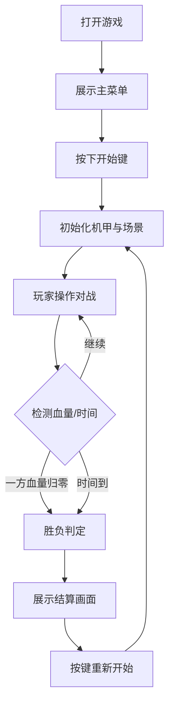

## 1. 产品概述
本项目是一个网页端运行的简单像素风机甲对战小游戏。
- 旨在提供一个双人同屏对战的复古像素风游戏体验，包含基本的移动、攻击、防御及胜负判定。
- 面向喜欢复古街机和像素美术风格的玩家。

## 2. 核心功能

### 2.1 游戏角色与状态
| 角色 | 控制方式 | 核心动作 |
|------|----------|----------|
| 玩家1 (左侧机甲) | 键盘 (W/A/S/D移动, J攻击, K防御) | 移动、攻击、防御、受击、死亡 |
| 玩家2 (右侧机甲) | 键盘 (方向键移动, Num1攻击, Num2防御) | 移动、攻击、防御、受击、死亡 |

### 2.2 功能模块
1. **主菜单/开始界面**: 游戏标题，开始游戏提示。
2. **对战界面**: 包含背景、两个机甲角色、双方血量条(UI)及倒计时。
3. **结算界面**: 显示胜负结果（Player 1 Win / Player 2 Win / Draw），提供重新开始选项。

### 2.3 页面详情
| 页面名称 | 模块名称 | 功能描述 |
|-----------|-------------|---------------------|
| 主界面 | 状态UI区 | 显示双方生命值(HP)条，屏幕中央显示倒计时或回合状态。 |
| 主界面 | 战斗区 | 两个像素风机甲的渲染，处理移动碰撞、攻击判定。 |
| 结算区 | 结果覆盖层 | 游戏结束后弹出，展示胜利者，按下特定键重新开始。 |

## 3. 核心流程
玩家进入游戏页面，点击开始后进入对战。双方通过键盘操作机甲互相攻击，当一方血量归零或时间耗尽时，判定胜负并展示结算画面。

## 4. UI与美术设计
### 4.1 设计风格
- **主色调**: 赛博朋克霓虹色或复古街机色（如高对比度的红蓝对抗）。
- **字体**: 像素风字体 (如 'Press Start 2P' 或类似像素英文字体)。
- **画面风格**: 8-bit / 16-bit 像素风。背景为像素风格的赛博朋克城市或荒野废墟。
- **角色设计**: 两个造型不同的像素机甲（使用 HTML5 Canvas 绘制几何像素块或代码生成的像素雪碧图实现）。

### 4.2 页面设计概览
| 页面名称 | 模块名称 | UI元素 |
|-----------|-------------|-------------|
| 游戏页 | 背景 | 像素风城市场景，静态或带简单视差滚动 |
| 游戏页 | UI层 | 顶部粗犷的像素风血条，红/绿色块；中间大号像素字体倒计时 |
| 游戏页 | 角色层 | 带有待机(Idle)、移动(Run)、攻击(Attack)、受击(Hit)状态的像素机甲 |

### 4.3 响应式设计
- 优先适配桌面端浏览器（需要物理键盘操作）。
- 画面固定比例（如 16:9，1024x576），在浏览器中居中缩放显示。

### 4.4 基础素材方案
- 使用 HTML5 Canvas 结合 JavaScript 游戏循环渲染。
- 考虑到纯代码实现 Demo，将通过 Canvas API 绘制纯色/渐变的矩形组合来模拟像素机甲，或者内置基础的 Base64 像素图来保证无需外部依赖即可运行。
