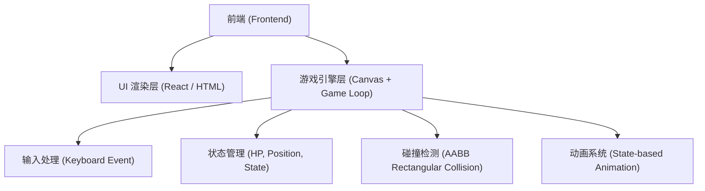

## 1. 架构设计
本项目采用纯前端架构，不依赖后端服务，主要利用 HTML5 Canvas API 和原生 JavaScript（或结合 React 等现代框架管理 UI 状态）进行游戏逻辑开发与渲染。

## 2. 技术栈说明
- **前端框架**: HTML + CSS + 原生 JavaScript / React@18 + Vite (用于构建外层 UI 和状态管理)
- **游戏渲染**: HTML5 Canvas 2D API
- **样式**: Tailwind CSS (用于 UI 界面布局，如血条、菜单、结算浮层)
- **初始化工具**: vite

## 3. 核心类与结构设计 (Game Engine)
- `Game`: 负责主循环 (`requestAnimationFrame`)，更新和绘制所有场景与对象，并控制倒计时。
- `Fighter`: 核心机甲实体类，包含物理属性（位置、速度、重力）、动作状态（待机、移动、攻击、防御）、以及 Hitbox（攻击判定框）。
- `InputHandler`: 统一处理键盘按键的按下与抬起事件，将事件映射到 Fighter 的具体操作。
- `Collision`: 简单的 AABB 矩形碰撞检测函数，用于判定攻击是否击中。

## 4. 路由定义
单页面应用，无需复杂路由管理。
| 路由 | 用途 |
|-------|---------|
| / | 游戏主界面与对战画面 |

## 5. 数据模型
前端本地状态管理，无数据库。
核心状态对象结构如下：
- `player1`: 
  - `position`: `{x: number, y: number}`
  - `velocity`: `{x: number, y: number}`
  - `hp`: `number` (初始 100)
  - `state`: `'idle' | 'run' | 'attack' | 'defend' | 'hit' | 'death'`
  - `attackBox`: `{position: {x, y}, width: number, height: number}`
- `player2`: 结构同上，面向方向相反。
- `gameState`: `'menu' | 'playing' | 'gameover'`
- `timer`: `number` (默认 60 秒)
