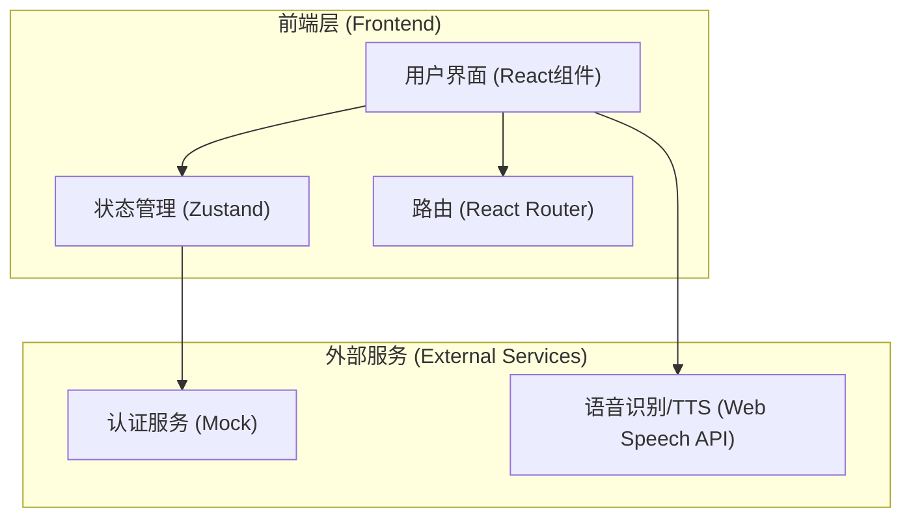

# 多语种在线教育平台技术架构文档 (Technical Architecture)

## 1. 架构设计


## 2. 技术说明
- 前端框架: React@18 + tailwindcss@3 + vite
- 初始化工具: vite-init
- 状态管理: Zustand (用于管理用户状态、学习进度、语种偏好)
- 图标库: Lucide React
- 动画库: Framer Motion (用于页面切换、单词卡片翻转、撒花动画等)
- 路由: React Router DOM v6
- 语音与互动: Web Speech API (用于听力播放与口语跟读的初步实现)
- 数据存储: 本地存储 (localStorage) 模拟后端数据库，持久化学习进度和用户设置

## 3. 路由定义
| 路由 | 目的 |
|-------|---------|
| `/` | 平台首页，展示特色与入口 |
| `/login` | 用户登录与注册页 |
| `/dashboard` | 学习仪表盘，展示进度与推荐 |
| `/courses` | 分级课程列表页 |
| `/practice/:courseId` | 互动式学习模块（单词、语法、口语、听力） |
| `/community` | 社区交流与成就榜单 |
| `/profile` | 个人中心与设置 |

## 4. API 定义 (前端 Mock 数据接口)
由于暂无真实后端，我们将使用 TypeScript 定义数据模型，并通过前端 Mock 接口模拟请求。

```typescript
// 用户接口
interface User {
  id: string;
  username: string;
  avatar: string;
  learningLanguage: string; // 'en' | 'jp' | 'kr'
  level: string; // 'A1' | 'A2' | 'B1' ...
  experiencePoints: number;
}

// 课程接口
interface Course {
  id: string;
  title: string;
  language: string;
  level: string;
  description: string;
  progress: number; // 0 - 100
}

// 社区帖子接口
interface Post {
  id: string;
  authorId: string;
  content: string;
  likes: number;
  comments: number;
  createdAt: string;
}
```