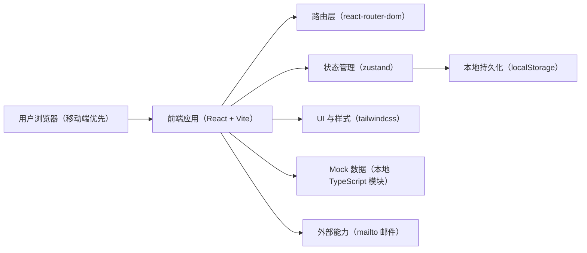
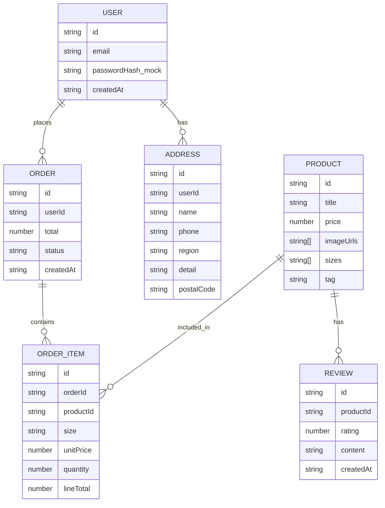

## 1. 架构设计

- 交付形态：纯前端 SPA（不依赖后端服务），核心数据使用 mock + localStorage 持久化
- 适用场景：快速验证交互与购物流程；后续可无缝替换为真实后端 API

## 2. 技术选型说明
- 前端：React@18 + TypeScript + Vite
- 路由：react-router-dom
- 样式：tailwindcss（统一设计 token 与响应式断点）
- 状态管理：zustand（购物车、登录态、订单、首访弹窗状态）
- 图标：lucide-react（统一线性 icon，不使用 emoji）
- 数据：本地 mock（商品、评价），localStorage（用户、购物车、地址、订单）
- 后端：无（本期不实现；接口以本地 service/adapter 方式预留替换点）

## 3. 路由定义
| Route | Purpose |
|------|---------|
| / | 首页（轮播、新品、热销、新用户弹窗） |
| /auth | 注册/登录（邮箱 mock） |
| /products | 商品列表 |
| /products/:id | 商品详情（大图、尺码、评价） |
| /cart | 购物车 |
| /checkout | 下单结算（收货地址、订单摘要） |
| /pay | 支付（mock） |
| /orders | 历史订单 |
| /contact | 联系官方（mailto） |
| * | 未上线/未匹配路由：空状态“敬请期待” |

## 4. 数据与领域模型

### 4.1 核心实体（概念 ER）

### 4.2 本地存储键（localStorage）
- app_auth_user：当前登录用户（email、id）
- app_users：已注册用户列表（mock，包含 passwordHash_mock）
- app_cart：购物车项（productId、size、unitPrice、quantity）
- app_checkout_address：最近一次结算地址
- app_orders：历史订单（含 items 与 address 快照）
- app_home_first_visit_dismissed：新用户弹窗是否已关闭

### 4.3 金额计算规则
- 行小计：unitPrice × quantity
- 订单总价：Σ 行小计
- 任何数量变化都应触发状态更新并即时反映在 UI（购物车与结算页一致）

## 5. 模块划分（建议）
- src/pages：Home / Auth / Products / ProductDetail / Cart / Checkout / Pay / Orders / Contact / ComingSoon
- src/components：轮播、商品卡、数量步进器、尺码选择、评价列表、空状态、顶部导航、底部栏
- src/stores：authStore / cartStore / orderStore / uiStore
- src/services：storage（localStorage 读写封装）、catalog（mock 商品）、pricing（金额计算）
- src/utils：format（货币/日期）、validation（表单校验）

## 6. 安全与隐私（本期约束）
- 登录/注册为 mock：仅用于演示流程，不承诺真实安全性
- 不在控制台或页面输出敏感信息
- 后续接入真实后端时：密码使用强哈希与服务端校验、启用 HTTPS、增加 CSRF/Rate limit 等

## 7. 测试与验收方式（建议）
- 单元测试：金额计算（unitPrice×quantity、总价汇总、数量边界）与 localStorage 适配层
- 组件测试：购物车数量变化是否触发 UI 总价更新
- 基础 E2E：从首页 → 列表 → 详情 → 加购 → 结算 → 支付成功 → 订单列表
